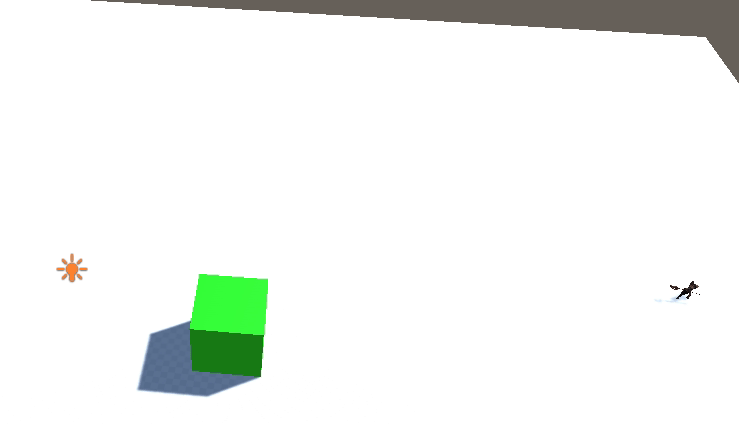

 

Evol is a multiplayer hero defense.

Part of the lore is generated using deep learning OpenAi's [gpt2](https://github.com/louis030195/gpt-2) (laziness xD)

The old machine learning part is [here](https://github.com/louis030195/Evol_ML), thinking about where to add ML in this project

# Videos
Oldest to newest:
- [Video 1](https://www.youtube.com/watch?v=PCzRj9FlzMM)
- [Video 2](https://www.youtube.com/watch?v=BP6NS7U8HWQ)
- [Video 3](https://www.youtube.com/watch?v=1MhD9d4IKyE)

# Features

- Abilities that can evolve with runes (duplicate, enlarge ...)
- Items / Inventory system
- Game loop
- Forest propagation
- Ugly but working UI
- Working multiplayer
- Account system

# Machine learning

The AI will use a finite state machine + the attack part will be handled by ML to predict where to throw ability to hit it's ennemy

# Contribution

Any contribution are welcome either development, assets or just ideas, feedbacks, advice just be sure to follow the [rules](docs/CONTRIBUTE.md)

# Thanks

A list of all assets used is [available](docs/REFERENCES.md)