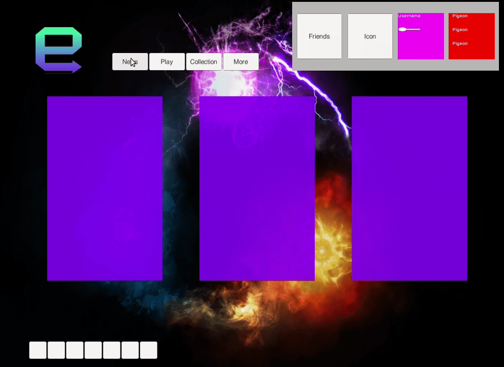
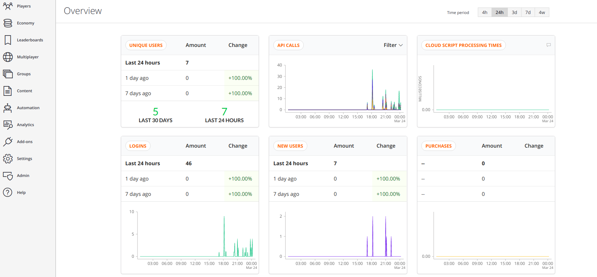
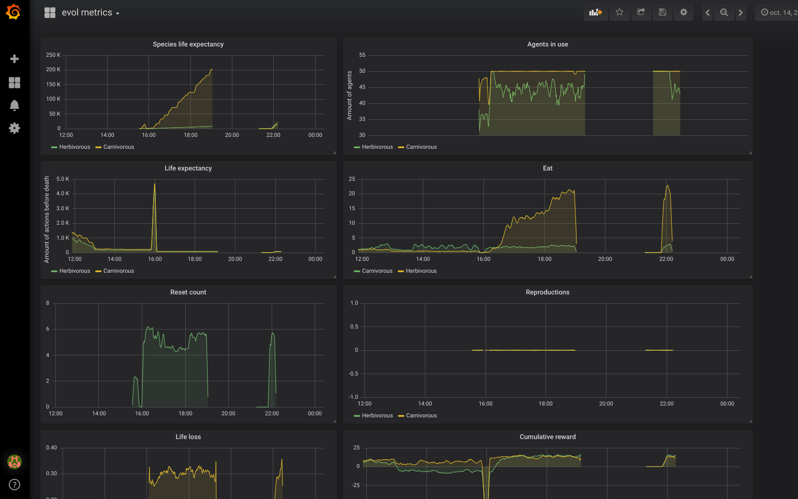

# Evol

[Video here](https://www.youtube.com/watch?v=xbMLg1NVD90&feature=youtu.be)







# Roadmap

- [ ] Mental control mage (take control of agents by switching to player brain, imitation learning to teach a herd of wolfes ...)
- [x] Game loop
- [x] Forest propagation
- [x] Ugly but working UI
- [ ] Well working multiplayer
- [x] Account system
- [ ] ML stuff

# Install

```
git clone https://github.com/louis030195/Evol.git
git clone https://github.com/Unity-Technologies/ml-agents.git
cd ml-agents
cp -R UnitySDK/Assets/ML-Agents/  ../Evol/UnityProject/Assets/
```

- Open the project with Unity

- Execute [TensorflowSharp](https://s3.amazonaws.com/unity-ml-agents/0.5/TFSharpPlugin.unitypackage)
plugin  and add it to the project

Open solution with rider (see [rider + unity](https://blog.jetbrains.com/dotnet/2017/08/30/getting-started-rider-unity/) for details) and press "update" or "restore" in nuget window of rider.

For networking, Evol uses Photon, find [pun 2 free](https://assetstore.unity.com/packages/tools/network/pun-2-free-119922?fbclid=IwAR180XMl887jvpNLv1xnrvVjiX6Esf-nZqTnQOJ2hQo3_fTO2V_1YFa1lH8) package in asset store (window/general/asset store) and install it.

### Train

Make sure to copy paste the config from Evol/UnityProject/Python/trainer_config.yaml
in ml-agents repository

Same for curriculum config (Evol/UnityProject/Python/evol/)

Run `mlagents-learn config/trainer_config.yaml --train` then press play in unity to train in editor mode


### Monitoring performances with Grafana & Prometheus



- Download and install [Grafana](https://grafana.com/grafana/download)
- Download and install [Prometheus](https://prometheus.io/download/)

Evol is using port 1234 to send metrics, just copy paste this prometheus config
into prometheus.yml

```
# Sample config for Prometheus.

global:
  scrape_interval:     15s # By default, scrape targets every 15 seconds.
  evaluation_interval: 15s # By default, scrape targets every 15 seconds.
  # scrape_timeout is set to the global default (10s).

  # Attach these labels to any time series or alerts when communicating with
  # external systems (federation, remote storage, Alertmanager).
  external_labels:
      monitor: 'example'

# Load and evaluate rules in this file every 'evaluation_interval' seconds.
rule_files:
  # - "first.rules"
  # - "second.rules"

# A scrape configuration containing exactly one endpoint to scrape:
# Here it's Prometheus itself.
scrape_configs:
  # The job name is added as a label `job=<job_name>` to any timeseries scraped from this config.
  - job_name: 'evol'

    # Override the global default and scrape targets from this job every 5 seconds.
    scrape_interval: 5s
    scrape_timeout: 5s

    # metrics_path defaults to '/metrics'
    # scheme defaults to 'http'.

    static_configs:
      - targets: ['localhost:1234']

  - job_name: node
    # If prometheus-node-exporter is installed, grab stats about the local
    # machine by default.
    static_configs:
      - targets: ['localhost:9100']

```

- Run prometheus / Restart if it was already started
- Run Grafana and start monitoring ! (load the Grafana/json file)
