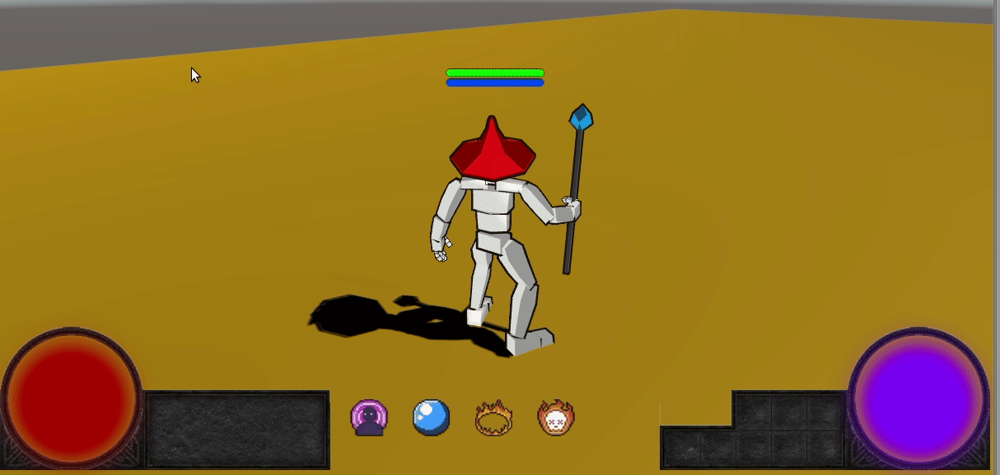
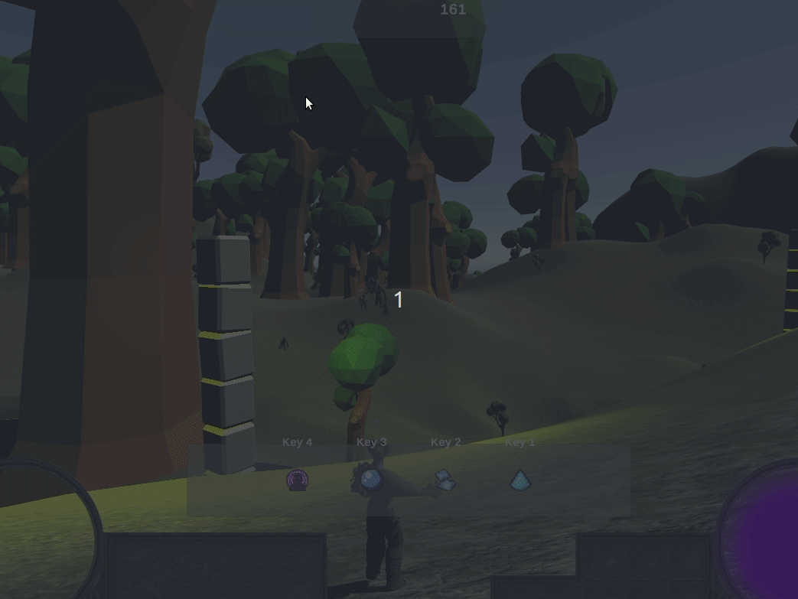

 

Evol was started as a fun project to play with [machine learning](https://github.com/Unity-Technologies/ml-agents) in Unity.

The machine learning part is paused for now and has been split to another repository.

Evol is a multiplayer hero defense inspired by Warcraft III mods.

# Videos

## Cooldown & spells

# Roadmap

- [ ] More characters, more spells
- [x] Spells evolution with runes
- [x] Items / Inventory system
- [x] Game loop
- [x] Forest propagation
- [x] Ugly but working UI
- [x] Working multiplayer
- [x] Account system
- [ ] ML stuff

# Contribution

Any contribution are welcome either development, assets or just ideas, feedbacks, advice just be sure to follow the [rules](docs/CONTRIBUTE.md)

# Thanks

A list of all assets used is [available](docs/REFERENCES.md)