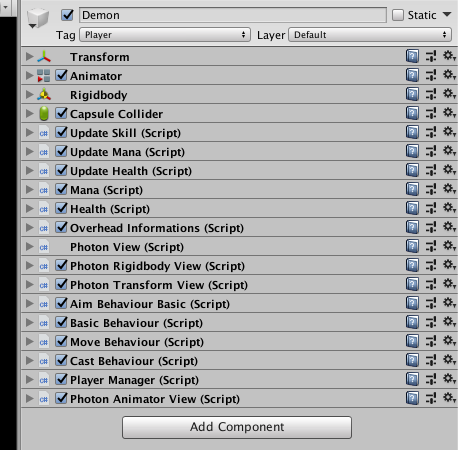
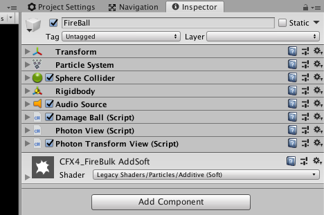

# Developpers doc
If you want to contribute to this project feel free to contact Louis.
## Unity development
### Best practices
try to follow this:
- [Nice list of good practices](http://www.gamasutra.com/blogs/HermanTulleken/20160812/279100/50_Tips_and_Best_Practices_for_Unity_2016_Edition.php)
### Naming convention
Use JetBrains Rider, it will fix your naming convention automatically (following Unity naming convention)
### Create a new character

Add these components to the prefab

Create a CharacterData Scriptable object:
Create/Evol/Character and fill with the appropriate data

Don't forget to put the photon animator view as last component (it seems to be required for trigger parameters)

### Create a new ability

Add these components to the prefab

Create a AbilityData Scriptable object:
Create/Evol/Ability and fill with the appropriate data

### Useful links
#### Tutorials
- [Nice Unity tutorials](https://catlikecoding.com/unity/tutorials/)
#### Machine learning
- [Github](https://github.com/Unity-Technologies/ml-agents)
#### Network
##### PlayFab
- [Getting started special Unity](https://api.playfab.com/docs/getting-started/unity-getting-started)
- [Unity tutorials](https://api.playfab.com/tutorials/unity)

#### Photon
- [Custom auth](https://doc.photonengine.com/en-us/realtime/current/connection-and-authentication/authentication/custom-authentication)